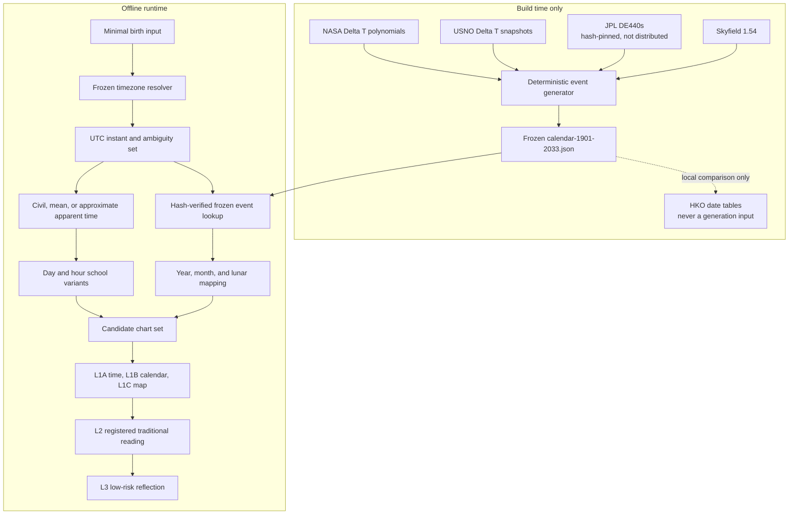

# Architecture

## Distribution boundary

The repository distributes the project-authored runtime, `tools/generate_calendar_data.py`, the frozen `calendar-1901-2033.json` result, and source-lock metadata. The frozen Node core SHA-256 is `8b3cb09c…773655`; the data SHA-256 is `65189952…4509`; the generator SHA-256 is `6f30b057…5405`; and the build-requirements SHA-256 is `6cfa326d…f4d8`. Full hashes are recorded in `NOTICE` and `provenance-manifest.json`.

The regeneration tool requires the user to download the hash-pinned build inputs locally. The repository does not distribute or load JPL DE440s, Skyfield, USNO source snapshots, NASA page text, or HKO static tables at runtime. The event table is generated once and treated as immutable release data. It retains nine non-expressive HKO comparison facts—both dates, a discrepancy code, and a locator—but no HKO table, row text, or complete dataset.

The public Gregorian input range is 1901-01-01 through 2033-12-31. Chinese-lunar label years have a 1900–2033 envelope, but both edges are partial: the first accepted nominal label is 1900 month 11 day 11 (non-leap), and the last is leap month 11 day 10 of 2033. Every label must convert uniquely into the public Gregorian envelope. The 1900–2034 calendar frame and event context through 2035-02-28 exist only to resolve endpoints; they do not extend the public birth range.

## Frozen v0.2 encoding

`xuanshu-calendar-data-v0.2` uses compact positional rows whose definitions are included inside the JSON:

- `terms`: `[unix_ms_ut1_proxy, term_index, model_guard_seconds, delta_t_source_code]`;
- `lunar_months`: ten fields, with `start_delta_t_source_code` at `row[8]` and `uncertainty_flags` at `row[9]`;
- `lunar_uncertainty_events`: nine fields, with `delta_t_source_code` at `row[6]`, followed by the assignment-change flag and alternate Beijing-day delta.

The source-code map distinguishes `NASA_PRE1973`, `USNO_MEASURED`, `USNO_PREDICTED`, and `CONTINUOUS_LINEAR_SCENARIO`. The generator tests the Cartesian product of guarded alternative Beijing dates for a new moon and every major term. If any combination could change major-term month membership, generation aborts and explicit alternate month sequences are required. The frozen v0.2 artifact passes that gate; date-level uncertainty remains encoded.

## Trust boundaries

- Python owns strict input validation, pinned-timezone resolution, longitude/EoT correction, uncertainty scenarios, lunar round-trip filtering, calendar-data hash verification, and canonical report assembly.
- Project-authored Node code owns frozen event lookup, lunar conversion, pillars, hidden stems, Ten Gods, Nayin, and Dayun sequence. It has no third-party calendrical runtime dependency.
- Skyfield 1.54, JPL DE440s, USNO Delta T snapshots, and NASA Delta T polynomial descriptions are build-time inputs only. Their exact source/version/hash roles are recorded in `provenance-manifest.json`.
- HKO conversion tables are a local date-level validation oracle only and never a generation input. No HKO table, row text, or complete dataset is copied into the repository. The generated file stores only nine independently derived, non-expressive discrepancy facts for audit.
- The agent may summarize returned L1A/L1B/L1C data but may not overwrite it or conflate the layers.
- Traditional interpretation is downstream, limited to `rule-registry.json`, and cannot mutate the chart.

## Absolute and local frames

Solar terms and new moons are derived at build time from JPL DE440s. The generator obtains events on the TT scale, then subtracts the frozen Delta T model and stores `unix_ms_ut1_proxy`: Unix milliseconds used as a UT1-as-UTC absolute-comparison proxy. It deliberately does not store TT JD and does not present the proxy as unqualified exact historical UTC. Frozen USNO Delta T records/predictions and independently implemented NASA polynomial segments define the supported time-scale mapping and per-event guard. This remains a documented model with boundary uncertainty; using JPL as the generation source is not an independent ephemeris certification.

The runtime compares the birth instant and frozen Lichun/Jie instants in one absolute frame. It uses a fixed Beijing UTC+8 calendar frame to assign lunisolar dates and determines whether a lunar month contains a principal term by Beijing calendar date, including the 2033 leap-eleventh-month case. It uses the selected local civil/solar clock only for day and hour. The approximate equation of time is evaluated from local mean solar time, so changing display timezone for the same UTC instant and longitude cannot change the result.

## Candidate model

Every combination of valid timezone fold, interval endpoint/interior/transition point, time basis, and supported Zi-hour policy becomes an `input_candidate` scenario. Approximate apparent-solar ±guard perturbations are separate `sensitivity_bracket` scenarios. Results merge only when chart, lunar date, solar-term context, and any provider-specific symbolic Dayun start agree. An uncertain birth time blocks that Dayun field. The report calculates stable/variable pillars from valid input candidates and lists sensitivity-only results separately; it never assigns an unsupported probability or claims that the current interval grid is a formally complete event solver.

Keep three review layers distinct:

- the user-configured `boundary_guard_seconds` asks how sensitive the returned chart is to an input-side perturbation;
- each frozen astronomical event's `model_guard_seconds` records a conservative Delta T/time-scale model band (600 seconds before 1973, approximately 2 seconds in the USNO measured segment, published prediction error rounded up plus 2 seconds in the USNO prediction segment, and a continuous scenario with at least 10 seconds after 2033.75 inside padding);
- an HKO authority divergence records a date/convention disagreement with a publication-table oracle and does not replace the frozen astronomical model.

None is a probability distribution or confidence interval. The post-2033.75 scenario is not an official prediction. A modern event merely lying within 600 seconds of Beijing midnight can trigger review, but that does not assign it a 600-second model error or require automatic failure. A point estimate must not silently erase a source-oracle disagreement.

Node response schema `xuanshu-four-pillars-core-response-v0.2` treats solar-term and lunar uncertainty differently:

- one guarded Jie expands the source case into `birth_before_term` and `birth_after_term` `calendar_model_variant` rows; `source_case_id` preserves normalization ownership, and `solar_term_boundary_uncertainty` records the event, source code, guard, and affected pillars;
- more than one guarded Jie fails closed with `CALENDAR_BOUNDARY_UNRESOLVED` because no exhaustive variant set is encoded;
- a Gregorian chart keeps the nominal fixed-UTC+8 lunar value and attaches `boundary_uncertainty`; when `unresolved_result_change_without_enumerated_variant` is true, the lunar label is indeterminate and cannot support a unique lunar-dependent conclusion;
- Chinese-lunar reverse conversion fails closed when the requested label is affected by a model-guard crossing or an explicit HKO authority divergence, while a `REVIEW_ONLY` event remains convertible.

Enumerated solar-term model consequences belong to the valid candidate set used to compute stable/variable pillars; they are not a `sensitivity_bracket`. The latter remains reserved for input-side/apparent-solar counterfactual perturbations.

## Dayun formula lineage

The four child-limit provider formulas are project-code rewrites of behavior inspected in the MIT-licensed `tyme4ts 1.5.2` implementation. The upstream license and attribution are retained, but no `tyme4ts` binary is bundled or loaded and it is not described as the calendar core. The provider manifest records the lineage, exact formulas, direction convention, and remaining lack of an independently verified normative traditional source.

## Upgrade path

The frozen dataset has completed its 1901–2033 HKO date-level rerun with 90 disclosed lunar daily-row divergences, six disclosed solar-term date divergences, and no additional differences. Every regeneration must repeat that oracle check. Independent certification additionally requires comparison against a high-precision event-time source independent of the JPL/Skyfield generation path, frozen tzdb assets inside the repository, complete event-boundary cases, and a published observed error/uncertainty envelope. See `VALIDATION.md`.
